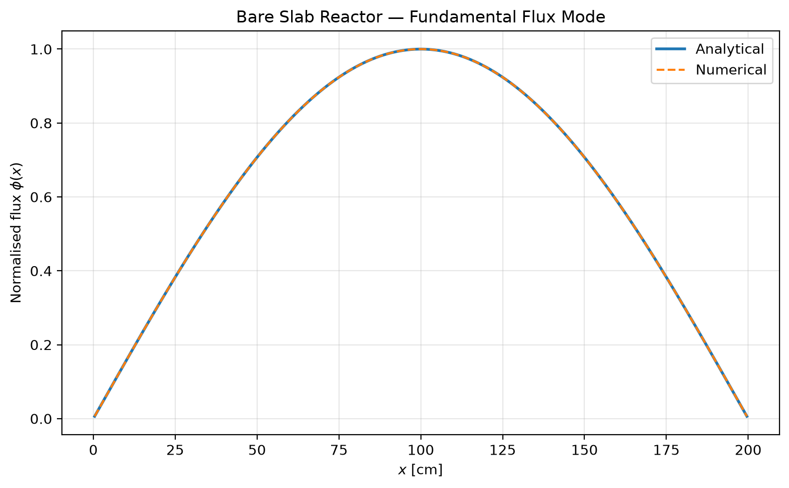
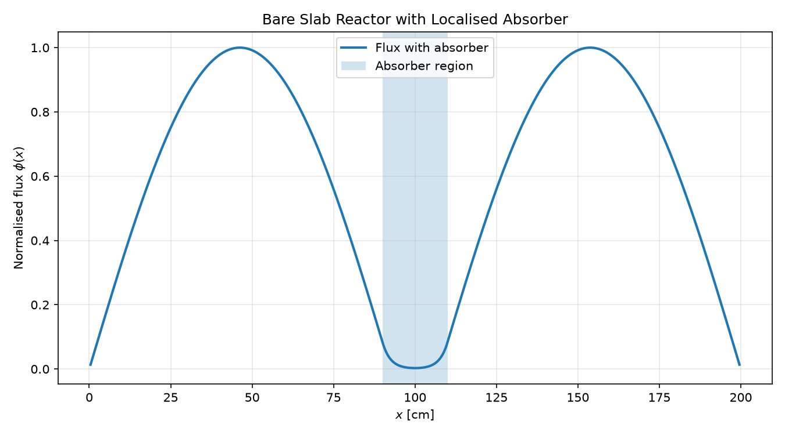
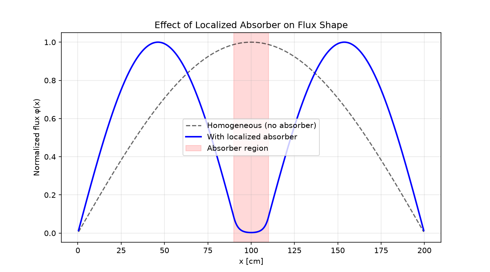

# Reactor Diffusion

A numerical study of one-dimensional neutron diffusion in homogeneous and heterogeneous slab reactors.

This project uses finite-difference methods and matrix eigenvalue problems to investigate reactor criticality, neutron flux profiles, and the convergence of numerical solutions.

## Overview

The project develops a simple one-dimensional reactor diffusion model and progressively introduces more realistic material behaviour.

The notebooks investigate:

- A homogeneous bare slab reactor with an analytical solution
- A slab reactor containing a localised absorbing region
- The effect of an absorber on the effective multiplication factor and neutron flux
- Numerical convergence and the effect of discontinuous material properties

The project was developed as part of my summer computational physics work.

## Methods

The reactor diffusion equation is discretised using a second-order central finite-difference scheme.

The resulting matrix eigenvalue problem is solved using NumPy's `eigh` routine to obtain the fundamental mode and effective multiplication factor,

$$
A\phi =
\frac{1}{k_{\mathrm{eff}}}\nu\Sigma_f\phi.
$$

For the heterogeneous reactor, the position-dependent absorption cross section is included as a diagonal matrix term.

## Notebooks

### `01_bare_slab_reactor.ipynb`

Introduces the one-dimensional homogeneous bare slab reactor.

The numerical solution is validated against the analytical results for:

- The effective multiplication factor $k_{\mathrm{eff}}$
- The fundamental neutron flux profile

The numerical calculation gives excellent agreement with the analytical solution, with a relative error in $k_{\mathrm{eff}}$ of approximately

$$
7.26\times10^{-9}.
$$

The fundamental flux profile also agrees closely with the analytical sinusoidal solution.



### `02_heterogeneous_absorber.ipynb`

Extends the model by introducing a localised region of increased absorption, representing a simplified control rod.

The notebook investigates:

- The reduction in $k_{\mathrm{eff}}$ caused by additional absorption
- Changes in the fundamental neutron flux
- Convergence with increasing grid resolution
- The effect of a discontinuous absorption profile on convergence

The absorber reduces $k_{\mathrm{eff}}$ from approximately $1.19734$ to $1.18767$ and produces a clear depression in the flux within the absorber region.



The notebook also investigates the observed reduction in convergence order for the sharp absorber. A smooth absorber profile is used as a controlled comparison, showing a substantial change in the fitted convergence order.



## Key Results

The project demonstrates how numerical modelling can be used to study both the physical behaviour of a reactor and the accuracy of the numerical method.

For the homogeneous bare slab, the numerical solution agrees closely with the analytical solution.

For the heterogeneous case, introducing additional absorption reduces the effective multiplication factor and changes the spatial distribution of the neutron flux.

The convergence study also shows that material discontinuities can affect the observed convergence behaviour of a finite-difference method. The sharp absorber gives a fitted convergence order of approximately $1.56$--$1.57$, while a smooth absorber profile gives an observed order of approximately $2.38$.

## Limitations

The model is intentionally simplified:

- It is one-dimensional.
- It uses a one-group diffusion approximation.
- The reactor geometry is restricted to a slab.
- The heterogeneous case does not have a simple analytical solution, so convergence is assessed against a high-resolution numerical reference.
- The absorber is represented by a simplified spatial absorption profile.

These limitations provide opportunities for future extensions to more realistic reactor geometries, material properties, and numerical methods.

## Requirements

- Python 3
- NumPy
- Matplotlib

## Project Structure

```text
reactor-diffusion/
│
├── notebooks/
│   ├── 01_bare_slab_reactor.ipynb
│   └── 02_heterogeneous_absorber.ipynb
│
├── assets/
│   ├── bare_slab_flux_profile.png
│   ├── heterogeneous_flux_profile.png
│   └── heterogeneous_vs_homogeneous_flux.png
│
└── README.md